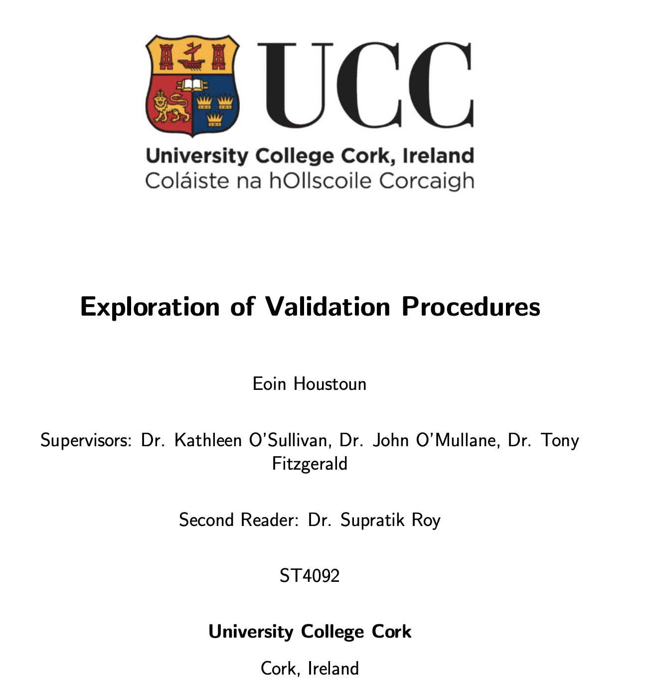

# An Exploration of Validation Procedures in Machine Learning

This project explores different validation strategies in predictive modelling, specifically applied to a case study: forecasting football players' transfer fees. By comparing validation methods such as traditional cross-validation, random splitting, and season-based temporal validation, the project aims to highlight how validation procedures significantly impact model evaluation and real-world predictive performance.

---

## Project Objectives

- Predict football players' transfer fees using various machine learning models.
- Examine and critically compare different validation procedures:
  - **Random hold-out validation**
  - **k-Fold cross-validation**
  - **Monte Carlo cross-validation**
  - **Season-based temporal validation**
- Evaluate the impact of validation procedures on model performance, stability, and real-world generalisability.

---

## Dataset

- **Source**: Football transfer data covering European league transfers (obtained from publicly available databases).
- **Sample size**: 1000+ transfer records
- **Features include**:
  - Player attributes (e.g., age, position, goals, assists)
  - Contractual data (contract length, previous transfer value)
  - Team-level metrics (league position, UEFA rankings, market value)
- **Target**: Player transfer fee (€ million, continuous target variable)

---

## Methods and Models Used

### Models:

- Linear Regression (baseline model)
- Regularised Linear Regression (Elastic Net)
- Decision Tree Regressor
- Random Forest Regressor

### Validation Procedures Explored:

- **Random Hold-out** 
- **k-Fold Cross-Validation**
- **Nested Cross-Validation**
- **Repeated k-Fold Cross-Validation** 
- **Monte Carlo Cross-Validation**
- **Bootstrapping**
- **Temporal Validation** (season-by-season splits to simulate real-world prediction scenarios)

### Evaluation Metrics:

- Root Mean Square Error (RMSE)
- Mean Absolute Error (MAE)
- Coefficient of Determination ($R^2$)

---

## Key Findings

- Random hold-out and k-fold validation methods often produce overly optimistic performance estimates.
- Temporal (season-based) validation provides more realistic performance estimates, closely aligning with real-world predictive accuracy.
- Repeated k-fold cross-validation, bootstrapping, and Monte Carlo cross-validation provide the most stable results but are computationally expensive.
- Predicted football players' transfer fees within an error margin of ±€8 million.
- Players' transfer fees were influenced significantly by the purchasing club's financial strength. For example, clubs like Manchester United tend to spend more due to higher available resources.

---

